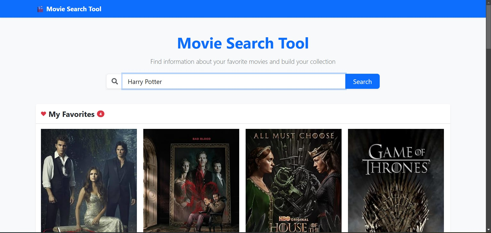
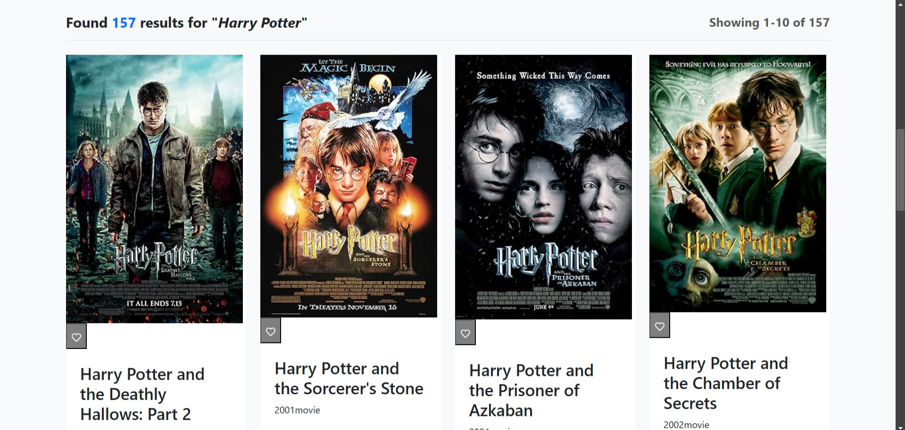

# Movie Search Tool





## 🎬 Overview

A responsive web application that allows users to search for movies using the OMDb API. This project was developed as part of a technical assessment for a Junior Full-Stack Developer position.

Live demo: [https://gisellejohnson.co.uk/movie-search-tool](https://gisellejohnson.co.uk/movie-search-tool)

## ✨ Features

### Core Requirements
- Search for movies by title using the OMDb API
- Display movie results with title, year, and poster
- View detailed movie information in a modal (plot, director, IMDb rating, etc.)
- Responsive design that works on mobile and desktop

### Bonus Features
- ✅ Loading state: Shows a spinner while fetching data
- ✅ Error handling: Displays user-friendly error messages
- ✅ Pagination: Navigate through multiple pages of results
- ✅ Favorites: Save favorite movies using local storage

### Additional Enhancements
- Comprehensive detail view with tabbed sections
- "Jump to page" feature for searches with many results
- Responsive movie card grid that adapts to different screen sizes

## 🛠️ Technologies Used

- **React** - UI library
- **Bootstrap** - CSS framework
- **Axios** - HTTP client for API requests
- **React Icons** - Icon library
- **Local Storage API** - For saving favorites

## 🚀 Setup and Installation

### Prerequisites
- Node.js (v14.0.0 or later)
- npm (v6.0.0 or later)

### Installation Steps

1. Clone the repository
   ```bash
   git clone https://github.com/yourusername/movie-search-tool.git
   cd movie-search-tool
   ```

2. Install dependencies
   ```bash
   npm install
   ```

3. Get an API key from [OMDb API](https://www.omdbapi.com/apikey.aspx)

4. Open `src/services/api.js` and replace the API key with your own:
   ```javascript
   const API_KEY = 'your-omdb-api-key';
   ```

5. Start the development server
   ```bash
   npm start
   ```

6. Open [http://localhost:3000](http://localhost:3000) in your browser

## 📦 Build for Production

```bash
npm run build
```

This creates a `build` directory with optimized production files.

## 📋 API Usage

This project uses the [OMDb API](https://www.omdbapi.com/) to fetch movie data. Two main endpoints are used:

1. Search by title: `https://www.omdbapi.com/?s={query}&page={page}&apikey={apiKey}`
2. Get movie details: `https://www.omdbapi.com/?i={imdbId}&apikey={apiKey}`

## 🌟 How to Use

1. Type a movie title in the search bar and click "Search"
2. Browse through the results or navigate through pages
3. Click on a movie card to view detailed information
4. Click the heart icon to add/remove a movie from favorites
5. View your favorite movies at the top of the page

## 📐 Project Structure

```
movie-search-tool/
├── src/
│   ├── components/
│   │   ├── SearchBar.jsx
│   │   ├── MovieList.jsx
│   │   ├── MovieCard.jsx
│   │   ├── MovieDetail.jsx
│   │   ├── Pagination.jsx
│   │   ├── Favorites.jsx
│   │   └── Loader.jsx
│   ├── services/
│   │   └── api.js
│   ├── App.js
│   └── index.js
├── public/
│   ├── favicon.ico
│   └── index.html
└── package.json
```

## 🔧 Future Improvements

- Add search filters (year, type, etc.)
- Implement user authentication
- Add movie recommendations
- Create custom lists beyond favorites
- Add movie trailers integration

## 📄 License

This project is open source and available under the [MIT License](LICENSE).

## 🙏 Acknowledgements

- [OMDb API](https://www.omdbapi.com/) for providing movie data
- [Cinema icons created by fjstudio - Flaticon](https://www.flaticon.com/free-icons/cinema) for the application icon
- Assessment requirements provided by [Employer Name]

---

Developed by [Giselle Johnson](https://gisellejohnson.co.uk) | © 2025